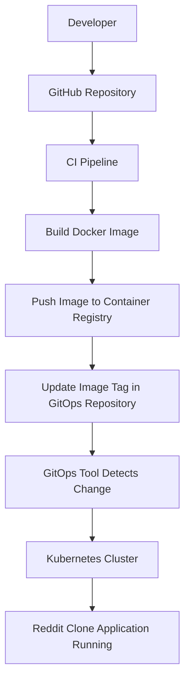

# Reddit Clone – GitOps Deployment (CD Pipeline)

This repository contains the **GitOps configuration for deploying the Reddit Clone application**.  
It is responsible for the **Continuous Deployment (CD)** stage of an end-to-end **CI/CD pipeline**.

The repository stores Kubernetes manifests that are automatically applied to the cluster using the **GitOps approach**, ensuring the cluster state always matches the configuration defined in Git.

---

## Project Overview

This project demonstrates a **complete DevOps workflow** for deploying a containerized Reddit Clone application using CI/CD and GitOps principles.

The **CI pipeline** builds and pushes Docker images, while this repository manages the **CD process** by storing Kubernetes manifests used to deploy the application.

Whenever changes are pushed to this repository, the GitOps tool automatically syncs the Kubernetes cluster with the updated configuration.

---

## CI/CD Pipeline Flow

Tech Stack
- GitHub – Source code management
- Docker – Containerization
- Kubernetes – Container orchestration
- GitOps – Declarative deployment strategy
- CI Tool (Jenkins / GitHub Actions) – Continuous Integration
- AWS / Cloud Infrastructure
- YAML Manifests – Kubernetes resource configuration

---

## Repository Purpose

This repository specifically manages the Continuous Deployment (CD) part of the CI/CD pipeline.

It contains the Kubernetes manifests required to deploy the Reddit Clone application and follows the GitOps model, where Git acts as the single source of truth for infrastructure and deployment configuration.

--- 

GitOps Workflow:
1. Developer pushes code changes to the application repository.
2. CI pipeline builds the Docker image.
3. The image is pushed to a container registry.
4. The image tag is updated in this GitOps repository.
5. The GitOps tool detects the change in Git.
6. Kubernetes cluster automatically synchronizes and deploys the updated application.

---

This ensures:
- Automated deployments
- Version-controlled infrastructure
- Consistent cluster state

---

Author

Akshay Suthar
B.Tech – Maulana Azad National Institute of Technology, Bhopal

DevOps | Cloud Computing | Kubernetes | AWS | Linux
